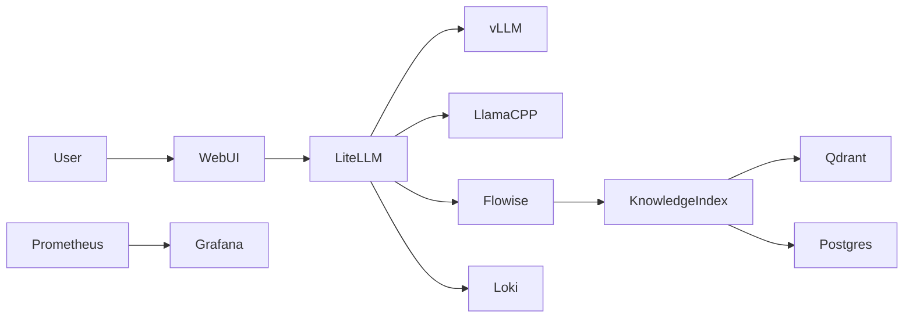
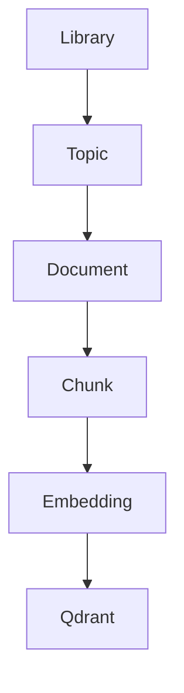
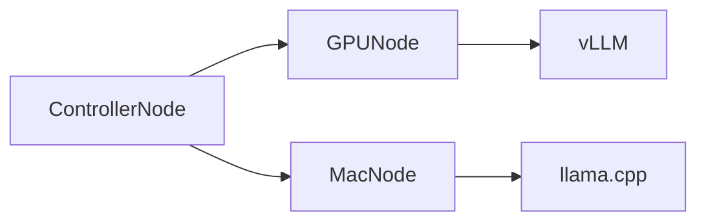

# AI Multivolume RAG Platform (Podman) Architecture
**Last Updated:** 2026-03-08 14:21 UTC

## Purpose (LLM-Agent Focused)
This document defines the architecture, deployment plan, and artifacts required to build a distributed, production-grade AI platform using Podman (v5.7+).
An LLM agent can read this document to generate infrastructure, deploy containers, configure services, and operate the system.

Key capabilities:

- Distributed LLM inference
- Hierarchical RAG knowledge libraries
- Multi-volume knowledge domains
- GPU and CPU fallback inference
- Rootless Podman deployment
- Observability and security

---

# Table of Contents

1. System Overview
2. Core Architecture
3. Component Responsibilities
4. Knowledge Library System
5. Hierarchical Retrieval Architecture
6. Model and Embedding Strategy
7. Distributed Node Architecture
8. Storage Layout
9. Networking
10. Monitoring and Telemetry
11. Security
12. Deployment Plan
13. Automation Scripts
14. Future Iterations

---

# 1 System Overview

This AI stack provides a modular platform built on:

- LiteLLM gateway
- vLLM GPU inference
- llama.cpp fallback inference
- Qdrant vector database
- PostgreSQL metadata storage
- Knowledge Index Service
- Flowise agent workflows
- OpenWebUI user interface
- Authentik authentication
- Prometheus / Grafana / Loki observability

Goals:

- scalable AI infrastructure
- modular knowledge libraries
- distributed inference
- reproducible deployment

---

# 2 Core Architecture



---

# 3 Component Responsibilities

| Component | Function |
|----------|----------|
OpenWebUI | user interface |
Flowise | workflow orchestration |
LiteLLM | model routing |
vLLM | GPU inference |
llama.cpp | CPU / Mac inference |
Qdrant | vector storage |
PostgreSQL | metadata database |
Knowledge Index | library indexing |
Authentik | identity provider |
Prometheus | metrics |
Grafana | dashboards |
Loki | logging |

---

# 4 Knowledge Library System

Libraries are independent knowledge volumes.

Example structure:

```
libraries/
   golang-best-practices/
   distributed-systems/
   linux-kernel/
```

Library package format:

```
.ai-library
```

Contents:

```
manifest.yaml
metadata.json
topics.json
documents/
vectors/
checksums.txt
signature.asc
```

---

# 5 Hierarchical Retrieval



Retrieval pipeline:

1 user request
2 select library
3 topic search
4 document retrieval
5 chunk similarity search

---

# 6 Model Strategy

Default inference models:

```
llama3.1-8b
deepseek-coder
llama3.1-70b (optional)
```

Embedding model:

```
BAAI/bge-large-en-v1.5
```

Embeddings stored in Qdrant.

---

# 7 Distributed Node Architecture



Controller node services:

- LiteLLM
- Flowise
- OpenWebUI
- Qdrant
- PostgreSQL
- Knowledge Index

---

# 8 Storage Layout

```
/opt/ai-stack/

models/
libraries/
qdrant/
postgres/
logs/
configs/
scripts/
backups/
```

---

# 9 Networking

Podman network:

```
ai-stack-net
```

Internal DNS examples:

```
litellm.ai-stack
qdrant.ai-stack
postgres.ai-stack
flowise.ai-stack
webui.ai-stack
```

Ports:

| Port | Service |
|------|--------|
9090 | WebUI |
9000 | API |
9443 | TLS |
91434 | Qdrant |

---

# 10 Monitoring

Observability stack:

- Prometheus
- Grafana
- Loki

Metrics collected:

- GPU utilization
- inference latency
- token usage
- retrieval latency

---

# 11 Security

Authentication provider:

Authentik

Features:

- SSO
- RBAC
- library access control

---

# 12 Deployment Plan

Deployment steps:

1 install Podman
2 validate system
3 create storage directories
4 configure container services
5 start systemd quadlets

---

# 13 Automation Scripts

Scripts included:

```
scripts/install.sh
scripts/validate-system.sh
scripts/deploy-stack.sh
```

These prepare the environment and deploy the containers.

---

# 14 Future Iterations

Planned improvements:

- service registry
- distributed vector shards
- GPU scheduling
- automated knowledge library generation
