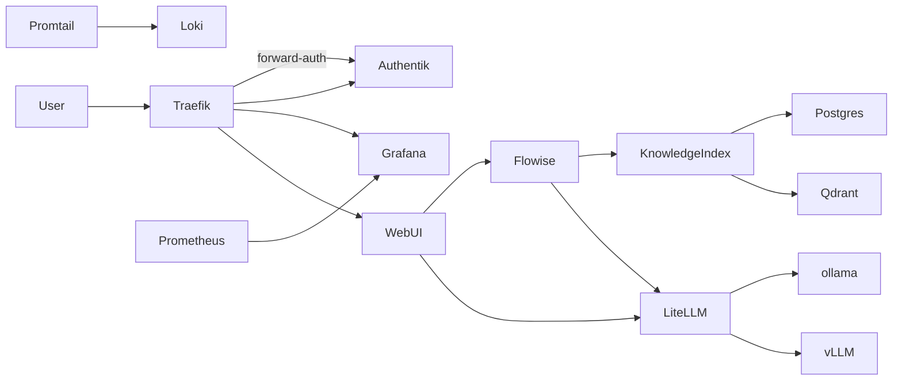
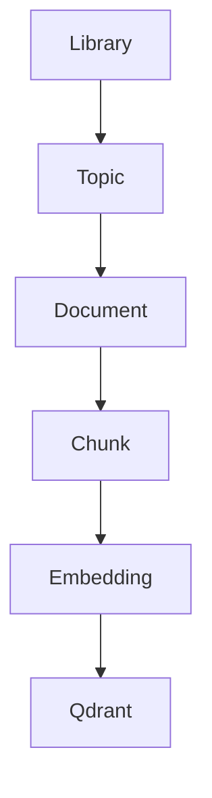
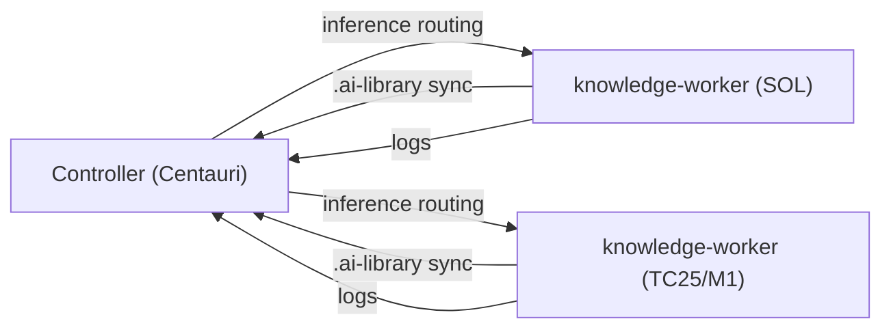

# AI Multivolume RAG Platform (Podman) Architecture
**Last Updated:** 2026-03-08 UTC

## Purpose (LLM-Agent Focused)
This document defines the high-level architecture, component relationships, and design decisions for a distributed, production-grade AI platform using Podman (v5.7+).
An LLM agent can read this document to understand the system design. Concrete implementation details and deployment artifacts are in [ai_stack_implementation.md](ai_stack_implementation.md). All tunable configuration values are in [ai_stack_configuration.md](ai_stack_configuration.md).

Key capabilities:

- Distributed LLM inference
- Hierarchical RAG knowledge libraries
- Multi-volume knowledge domains
- GPU and CPU fallback inference
- Rootless Podman deployment
- Observability and security

---

# Table of Contents

1. System Overview
2. Core Architecture
3. Component Responsibilities
4. Knowledge Library System
5. Hierarchical Retrieval Architecture
6. Model and Embedding Strategy
7. Distributed Node Architecture
8. Storage Layout
9. Networking
10. Monitoring and Telemetry
11. Security
12. Deployment Plan
13. Automation Scripts
14. Implementation Tracking
15. Future Iterations

---

# 1 System Overview

This AI stack provides a modular platform built on:

- Traefik reverse proxy and TLS termination
- LiteLLM gateway
- vLLM GPU inference
- ollama local inference
- Qdrant vector database
- PostgreSQL metadata storage
- Knowledge Index Service
- Flowise agent workflows
- OpenWebUI user interface
- Authentik authentication
- Prometheus / Grafana / Loki observability

Goals:

- scalable AI infrastructure
- modular knowledge libraries
- distributed inference
- reproducible deployment

---

# 2 Core Architecture



---

# 3 Component Responsibilities

| Component | Function |
|----------|----------|
| Traefik | Reverse proxy, TLS termination, forward-auth with Authentik |
| OpenWebUI | User interface |
| Flowise | Workflow orchestration |
| LiteLLM | Model routing gateway |
| vLLM | GPU inference |
| ollama | Local model inference (CPU/metal, OpenAI-compatible) |
| Qdrant | Vector storage |
| PostgreSQL | Metadata database |
| Knowledge Index | Library indexing and retrieval |
| Authentik | Identity provider (SSO/OIDC) |
| Prometheus | Metrics collection |
| Grafana | Dashboards and alerting |
| Loki | Log aggregation |
| Promtail | Log shipping to Loki |

---

# 4 Knowledge Library System

Libraries are independent knowledge volumes.

Example structure:

```
libraries/
   golang-best-practices/
   distributed-systems/
   linux-kernel/
```

Library package format:

```
.ai-library
```

Contents:

```
manifest.yaml       # Volume identity, version, author, license, profile compatibility
metadata.json       # Machine-readable: topic tags, embedding model, document count, vector dimensions
topics.json         # Human/LLM-readable topic taxonomy
documents/          # Source documents
vectors/            # Pre-computed embeddings
checksums.txt       # Integrity verification (all profiles)
signature.asc       # Provenance verification (WAN mandatory, local optional, localhost skip)
```

See D-013 in the project decision log for the full specification rationale.

### Discovery Profiles

Knowledge libraries are discovered through one of three profiles, selected per deployment context:

| Profile | Mechanism | Trust Model | Verification |
|---------|-----------|-------------|--------------|
| **localhost** | Filesystem scan of `$AI_STACK_DIR/libraries/` | Implicit — operator placed the files | `checksums.txt` only |
| **local** | mDNS/DNS-SD on local network | Network membership + optional signature | `checksums.txt` + optional `signature.asc` |
| **WAN** | Registry/federation protocol | Mandatory cryptographic verification | `checksums.txt` + mandatory `signature.asc` |

Profiles are a property of both the deployment instance (which mechanisms it activates) and the volume (which profiles it advertises in `manifest.yaml`). MVP implements localhost only; local and WAN are specified but deferred. See D-014 in the project decision log.

Ingestion overview:

1. Documents are added to a library's `documents/` directory
2. The Knowledge Index Service chunks and embeds documents
3. Embeddings are stored in Qdrant under the library's collection
4. Metadata is recorded in PostgreSQL
5. `checksums.txt` and `manifest.yaml` are updated

Schema and detailed ingestion configuration are defined in [ai_stack_implementation.md](ai_stack_implementation.md).

---

# 5 Hierarchical Retrieval



Retrieval pipeline:

1. User request
2. Select library
3. Topic search
4. Document retrieval
5. Chunk similarity search

---

# 6 Model and Embedding Strategy

Default inference models:

```
llama3.1-8b
deepseek-coder
llama3.1-70b (optional)
```

Embedding model:

```
BAAI/bge-large-en-v1.5
```

Embedding service: vLLM serves the embedding model alongside inference models. A dedicated embedding endpoint is exposed through LiteLLM.

Model management:

- Models are downloaded to `/opt/ai-stack/models/` and shared across inference containers via bind mounts
- Model files are cached locally; no re-download on container restart
- LiteLLM routes requests to the appropriate model/backend

Embeddings stored in Qdrant. Image versions and model parameters are in [ai_stack_configuration.md](ai_stack_configuration.md).

---

# 7 Distributed Node Architecture

## Node Management Layers

Five distinct concerns govern how the controller and workers interact. Each is handled by a specific subsystem and must be understood independently:

| Layer | Concern | Handled By | Status |
|---|---|---|---|
| **Presence** | Is the node online? What is its stable IP? | Headscale — WireGuard keep-alive + `tailscale status` | Live (D-004) |
| **Node Configuration** | What profile, capabilities, and models does the node have? | `node.sh configure` (local write) + `node.sh list --refresh` (controller SSH-pull) | BL-012 |
| **Command/Control (CNC)** | Send directives from controller to worker (pull models, restart, config reload) | BL-015 (design pending); heartbeat response today handles rename only | BL-015 |
| **Registry Read** | Query node state, capabilities, and status | `node.sh list`, `GET /admin/v1/nodes` | Live |
| **Registry Write** | Register, join, rename, purge, deregister nodes | `configure.sh generate-join-token` + `node.sh join/unjoin/purge` + `POST /admin/v1/nodes` | Live |

These layers are intentionally decoupled. Presence is owned entirely by Headscale — the application layer never manages WireGuard keys or DERP routing. CNC is isolated from the heartbeat path so that heartbeat failures remain non-blocking and low-stakes.

---



Controller node services:

- Traefik (network edge, TLS termination)
- LiteLLM (model gateway, inference routing)
- OpenWebUI (chat UI)
- Flowise (workflow orchestration)
- Qdrant (vector DB — custody knowledge store)
- PostgreSQL (Authentik, LiteLLM, Knowledge Index)
- Knowledge Index (library registry + provenance)
- Authentik (SSO IdP)
- Prometheus / Grafana / Loki (observability)

`knowledge-worker` node services:

- Ollama (local inference)
- Promtail (log shipper → controller Loki)
- Knowledge Index (local KI, SQLite metadata store)
- Qdrant (local vector DB for worker-authored libraries)

Node profiles and hardware requirements:

| Profile | CPU | RAM | Storage | GPU | Services |
|---|---|---|---|---|---|
| `controller` | 8+ cores | 32+ GB | 500 GB SSD | Not required | Full stack: Traefik, LiteLLM, OpenWebUI, Flowise, Qdrant (custody), PostgreSQL, KI, Grafana, Prometheus, Loki |
| `inference-worker` | 4+ cores | 8+ GB | 50 GB SSD | Optional | Ollama, Promtail |
| `knowledge-worker` | 4+ cores | 10+ GB | 50+ GB SSD | Optional | Ollama, Promtail, Knowledge Index (SQLite), Qdrant (local) |
| `peer` | 8+ cores | 32+ GB | 200+ GB SSD | Optional | Full stack (future: disconnected/field deployment) |

---

# 8 Storage Layout

Base path: `/opt/ai-stack/` (or `$HOME/ai-stack` for rootless deployments)

```
/opt/ai-stack/
├── models/       # Downloaded LLM and embedding model files
├── libraries/    # Knowledge library packages
├── qdrant/       # Qdrant persistent storage
├── postgres/     # PostgreSQL data directory
├── logs/         # Centralized log output
├── configs/      # Service configuration files
├── scripts/      # Automation and deployment scripts
└── backups/      # Scheduled backup artifacts
```

Volume mount mappings per container are defined in [ai_stack_configuration.md](ai_stack_configuration.md).

---

# 9 Networking

Podman network:

```
ai-stack-net
```

### Traefik Reverse Proxy

Traefik is the network edge — the only component that exposes ports to the host. All user-facing services (OpenWebUI, Grafana, Flowise, Authentik) are accessed through Traefik. Internal services (LiteLLM, Qdrant, PostgreSQL, etc.) are only reachable on the internal Podman network.

Traefik provides:
- **TLS termination** — HTTPS on ports 443 (HTTPS) and 80 (HTTP → redirect to HTTPS)
- **Forward-auth** — Authentik middleware validates session tokens before routing to backend services
- **Dynamic routing** — file-based dynamic configuration (Podman does not expose a Docker-compatible socket by default; labels are read via a file provider)

Routing is configured via Traefik's file provider, with one dynamic config file per service. Configuration files live in `$AI_STACK_DIR/configs/traefik/dynamic/`.

Internal DNS examples:

```
traefik.ai-stack
litellm.ai-stack
qdrant.ai-stack
postgres.ai-stack
flowise.ai-stack
webui.ai-stack
authentik.ai-stack
```

Ports:

| Port | Service |
|------|--------|
| 443 | Traefik HTTPS (TLS termination) |
| 80 | Traefik HTTP (redirect to HTTPS) |
| 9090 | OpenWebUI (internal, behind Traefik) |
| 9000 | LiteLLM API gateway (internal) |
| 6333 | Qdrant REST API (internal) |
| 6334 | Qdrant gRPC (internal) |

---

# 10 Monitoring and Telemetry

Observability stack:

- Prometheus — metrics collection and storage
- Grafana — dashboards and alerting
- Loki — log aggregation
- Promtail — log shipping from containers to Loki

Metrics collected:

- GPU utilization
- Inference latency
- Token throughput
- Retrieval latency
- Container resource usage

Log collection:

Promtail collects container logs via Podman's journald or file-based log driver and ships them to Loki. Alerting rules are in [ai_stack_implementation.md](ai_stack_implementation.md). Dashboard and health check configuration is in [ai_stack_configuration.md](ai_stack_configuration.md).

---

# 11 Security

Authentication provider: Authentik

Security architecture:

- **Authentication:** Authentik provides SSO via OIDC for all user-facing services (OpenWebUI, Grafana, Flowise)
- **Authorization:** RBAC controls access to knowledge libraries and administrative functions
- **Network isolation:** Services communicate over the internal `ai-stack-net` Podman network; only designated ports are exposed to the host
- **Secrets management:** Sensitive values (database passwords, API keys, TLS certificates) are managed via Podman secrets — never stored in plain text in configuration files
- **Container isolation:** Rootless Podman provides user-namespace isolation; no containers run as host root
- **Image integrity:** Container images are pulled from pinned digests or signed tags

Concrete OIDC configuration and TLS setup are in [ai_stack_implementation.md](ai_stack_implementation.md). Secret definitions and network isolation details are in [ai_stack_configuration.md](ai_stack_configuration.md).

---

# 12 Deployment Plan

Deployment steps:

1. Install Podman and dependencies
2. Validate system prerequisites
3. Create storage directories
4. Configure secrets and environment
5. Deploy container services via systemd quadlets
6. Verify health checks and connectivity

---

# 13 Automation Scripts

Scripts are in the project root `scripts/` directory. Configuration is in `configs/config.json`.

| Script | Purpose |
|--------|--------|
| `scripts/install.sh` | Install dependencies and create storage layout |
| `scripts/validate-system.sh` | Validate prerequisites (Podman, GPU, storage) |
| `scripts/configure.sh` | CRUD operations on config.json; generates quadlets and secrets |
| `scripts/deploy.sh` | Validate config, generate quadlets, create network |

These are bootstrap and configuration scripts. Full deployment procedures are in [ai_stack_implementation.md](ai_stack_implementation.md). Tunable values live in `configs/config.json` and are documented in [ai_stack_configuration.md](ai_stack_configuration.md).

---

# 14 Implementation Tracking

Items tracked for the implementation phase. See [ai_stack_checklist.md](ai_stack_checklist.md) for the master task list. Configuration values are in [ai_stack_configuration.md](ai_stack_configuration.md). Procedures are in [ai_stack_implementation.md](ai_stack_implementation.md).

**Blockers** (required before first deployment):

| Item | Status | Reference |
|------|--------|----------|
| Container image references and version pins | Not started | Configuration §1 |
| Environment variables per service | Not started | Configuration §2 |
| Volume mount specifications | Not started | Configuration §6 |
| Secrets management (Podman secrets) | Not started | Implementation §1 |
| Quadlet unit files | Not started | Implementation §2 |
| Service dependency and startup order | Not started | Implementation §3 |

**Deferrable** (address incrementally post-deployment):

| Item | Status | Reference |
|------|--------|----------|
| Resource limits (CPU/memory/GPU) | Not started | Configuration §3 |
| Health checks and readiness probes | Not started | Configuration §10 |
| GPU passthrough (CDI) configuration | Not started | Implementation §4 |
| Authentik OIDC integration details | Not started | Implementation §5 |
| Library manifest YAML schema | Not started | Implementation §6 |
| Alerting rules (Prometheus) | Not started | Implementation §7 |
| Backup and restore procedures | Not started | Implementation §8 |
| Troubleshooting guide | Not started | Implementation §9 |

---

# 15 Future Iterations

Planned improvements:

- Service registry and discovery
- Distributed vector shards (multi-node Qdrant)
- GPU scheduling and multi-tenant inference
- Automated knowledge library generation
- Multi-model A/B testing through LiteLLM
- Federated RAG across remote library nodes
