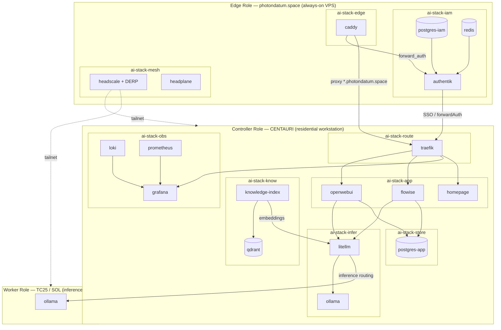

# Roles

Role documents define the abstract deployment blueprint for a class of node.
Each role specifies which deployment groups it owns, what it depends on, which
scripts support it, and what an instance overlay must provide to make it concrete.

Roles are not host-specific. The per-host customizations (IP addresses, domain
names, network mode, resource limits) live in [docs/instances/](../instances/).

---

## Architecture Diagram

**Solid arrows** — application-level request or data flow.
**Dotted arrows** — network-layer connectivity (Headscale tailnet provides the
transport; it does not route application traffic directly).

---

## Role Documents

### [edge-role.md](edge-role.md)

Always-on, publicly reachable host. Owns identity (`ai-stack-iam`), mesh
coordination (`ai-stack-mesh`), and public ingress (`ai-stack-edge`). Runs
Authentik as the SSO authority for the entire stack, Headscale for the WireGuard
overlay network, and Caddy as the public TLS-terminating reverse proxy. All other
roles depend on this one being up for external access and mesh enrollment to work.

**Deployment target:** VPS (photondatum.space)
**Groups:** `ai-stack-iam`, `ai-stack-mesh`, `ai-stack-edge`

---

### [controller-role.md](controller-role.md)

Primary compute node. Orchestrates AI inference, runs the knowledge pipeline,
hosts user-facing applications, and aggregates observability data from all nodes.
All AI workloads route through this role. Requires the edge role for external SSO
but remains functional on the LAN when the edge role is offline.

**Deployment target:** Residential workstation (CENTAURI)
**Groups:** `ai-stack-route`, `ai-stack-infer`, `ai-stack-know`, `ai-stack-app`, `ai-stack-store`, `ai-stack-obs`

---

### [worker-role.md](worker-role.md)

Inference extension node. Runs Ollama (and optionally vLLM) and registers with
the controller's heartbeat system. LiteLLM on the controller routes model requests
to registered workers automatically. Workers are additive — the stack functions
without them, they just add inference capacity or GPU access. Requires both the
edge role (for mesh enrollment) and the controller role (for registration).

**Deployment target:** Any inference-capable machine (TC25, SOL, or future nodes)
**Groups:** `ai-stack-infer` (subset — runtimes only, no gateway)
