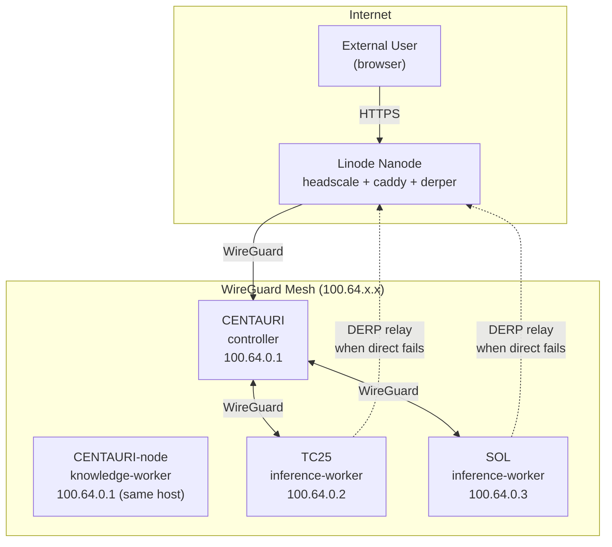
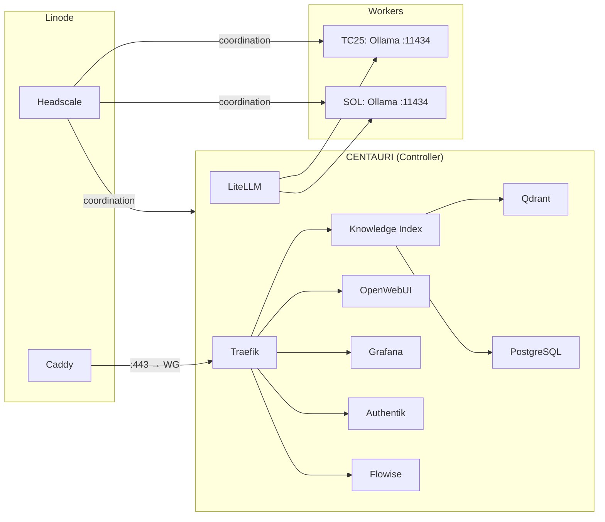
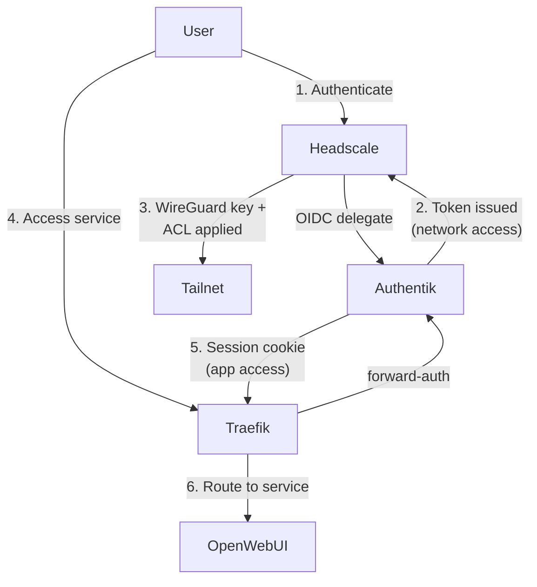

# Technical Proposal: Headscale Mesh Network Migration

**Status:** Draft
**Author:** Operator (with agent assistance)
**Date:** 2026-04-09
**Target Audience:** Human operators and LLM agents executing migration phases

---

## Table of Contents

1. [Executive Summary](#1-executive-summary)
2. [Glossary](#2-glossary)
3. [Current State Assessment](#3-current-state-assessment)
4. [Proposed Architecture](#4-proposed-architecture)
5. [System Diagrams](#5-system-diagrams)
6. [Pros and Cons](#6-pros-and-cons)
7. [Access Control and User Management](#7-access-control-and-user-management)
8. [Script and Component Replacement Analysis](#8-script-and-component-replacement-analysis)
9. [Modular Networking Abstraction](#9-modular-networking-abstraction)
10. [Infrastructure Provisioning](#10-infrastructure-provisioning)
11. [Domain Acquisition and DNS](#11-domain-acquisition-and-dns)
12. [Migration Plan](#12-migration-plan)
13. [Lateral Thinking: Options to Consider](#13-lateral-thinking-options-to-consider)
14. [Risk Assessment](#14-risk-assessment)
15. [Cost Summary](#15-cost-summary)
16. [References](#16-references)

---

## 1. Executive Summary

The AI stack currently relies on a consumer WiFi network and local DNS (`SERVICES.mynetworksettings.com`) for inter-node communication. This architecture has four documented fragilities:

| Fragility | Severity |
|---|---|
| WiFi is the only external path for worker heartbeats | **High** |
| No controller fallback URL in heartbeat.sh | Medium |
| Self-signed CA not distributed to workers → `--insecure` everywhere | Medium |
| Traefik is required intermediary for all KI access | Low-Medium |

This proposal replaces the current networking layer with **Headscale** — a self-hosted, open-source implementation of the Tailscale coordination server. The result is a WireGuard mesh network providing:

- **Stable 100.x.x.x addresses** that survive WiFi outages, DHCP changes, and roaming
- **End-to-end WireGuard encryption** eliminating the self-signed CA and `--insecure` flags
- **ACL-based segmentation** controlling which nodes and users can reach which services
- **External access** for users outside the LAN without port forwarding or dynamic DNS
- **Offline resilience** via a Linode relay point with a static 503 fallback page

The current non-Headscale networking remains available as a **fallback module** — a config.json selector switches between `local`, `headscale`, and `tailscale` networking modes.

---

## 2. Glossary

| Term | Definition |
|---|---|
| **Headscale** | Open-source, self-hosted implementation of the Tailscale coordination server. Manages WireGuard key exchange, node registration, and ACL enforcement. |
| **Tailscale** | Commercial SaaS product providing the same WireGuard mesh networking. Headscale is the self-hosted alternative to the Tailscale coordination server. |
| **WireGuard** | Modern, lightweight VPN protocol. All data-plane traffic between nodes is encrypted by WireGuard directly — the coordination server never sees payload data. |
| **DERP** | Designated Encrypted Relay for Packets. A relay server used when two nodes cannot establish a direct WireGuard connection (e.g., both behind strict NAT). Traffic is still end-to-end encrypted. |
| **derper** | The Tailscale DERP relay server binary. Self-hostable via a single Go binary or Docker image. |
| **Tailnet** | The virtual network created by the coordination server. Every node receives a stable `100.64.x.x` (CGNAT range) address. |
| **MagicDNS** | Automatic DNS within the tailnet. Each node gets a hostname like `centauri.tailnet.ts.net` that resolves to its `100.x.x.x` address. Provided by Headscale. |
| **Pre-auth key** | A token generated on the coordination server that allows a node to join the tailnet without interactive login. Used for unattended/scripted node registration. |
| **ACL** | Access Control List. In Headscale, a JSON/YAML policy defining which nodes/users/groups can communicate on which ports. |
| **Tag** | A label applied to a node (e.g., `tag:controller`, `tag:inference`). Tags are used in ACL rules to group nodes by function rather than by name. |
| **OIDC** | OpenID Connect. Headscale supports OIDC for user authentication, enabling integration with Authentik as the identity provider. |
| **Caddy** | Modern web server with automatic HTTPS (Let's Encrypt). Used as the public-facing reverse proxy on the Linode relay. |
| **CGNAT range** | `100.64.0.0/10` — the IP range used by Tailscale/Headscale for overlay addresses. Not routable on the public internet. |
| **Linode Nanode** | Akamai (Linode) smallest VPS tier: 1 vCPU, 1 GB RAM, 25 GB SSD, 1 TB transfer. $5/month. |

---

## 3. Current State Assessment

### 3.1 Node Inventory

| Alias | Node ID | Profile | OS | Address | Role |
|---|---|---|---|---|---|
| `controller-1` | CENTAURI | controller | Linux (Fedora) | `SERVICES.mynetworksettings.com` | Full stack host |
| `knowledge-worker-1` | CENTAURI-node | knowledge-worker | Linux (Fedora) | `ki.stack.localhost` | Same-host KI + inference |
| `inference-worker-1` | TC25 | inference-worker | macOS (M1) | `TC25.mynetworksettings.com` | Portable — roams to library, café |
| `inference-worker-2` | SOL | inference-worker | Linux | `SOL.mynetworksettings.com` | Stationary inference node |

### 3.2 Current Traffic Paths

```
External Workers (TC25, SOL)
        │
        ▼
   Home WiFi Router (DHCP)
        │
        ▼
  SERVICES.mynetworksettings.com → 10.19.208.142 (WiFi interface: wlp70s0)
        │
        ▼
   Traefik (:443, self-signed CA)
        │
        ├─→ Knowledge Index (ki.stack.localhost / SERVICES.mynetworksettings.com)
        ├─→ OpenWebUI (openwebui.stack.localhost)
        ├─→ Grafana (grafana.stack.localhost)
        ├─→ Authentik (auth.stack.localhost)
        └─→ Flowise (flowise.stack.localhost)
```

### 3.3 Documented Problems

1. **WiFi SPOF**: `SERVICES.mynetworksettings.com` resolves to `wlp70s0` (WiFi). WiFi down = all workers offline simultaneously. Wired interface (`enp68s0` @ `10.19.208.109`) is up but unreachable from workers.
2. **No fallback URL**: `heartbeat.sh` reads a single `controller_url` from state — no retry with an alternate address.
3. **Self-signed CA not distributed**: Every worker curl uses `--insecure`. No certificate pinning.
4. **Roaming nodes break**: TC25 at a library gets a different IP. `TC25.mynetworksettings.com` no longer resolves. Manual intervention required.
5. **No external user access**: Users outside the LAN cannot reach OpenWebUI or Grafana without port forwarding (not configured, not desired).

---

## 4. Proposed Architecture

### 4.1 Overview

Deploy **Headscale** on a **Linode Nanode** ($5/month) as the coordination server. All AI stack nodes join the Headscale tailnet and communicate over WireGuard-encrypted `100.64.x.x` addresses. A **Caddy** reverse proxy on the same Linode provides the public-facing HTTPS entry point for external users.

### 4.2 Component Placement

| Component | Runs On | Purpose | RAM |
|---|---|---|---|
| **Headscale** | Linode Nanode | WireGuard coordination, key exchange, ACL enforcement, MagicDNS | ~40 MB |
| **Caddy** | Linode Nanode | Public HTTPS reverse proxy, automatic Let's Encrypt certs, 503 offline fallback | ~25 MB |
| **derper** | Linode Nanode | DERP relay for NAT traversal (only used when direct WireGuard fails) | ~25 MB |
| **Tailscale client** | Every node | WireGuard data plane, sidecar daemon | ~30 MB |

**Total Linode memory footprint:** ~90 MB of 1024 MB available — leaves ample headroom.

### 4.3 Traffic Flow: External User → OpenWebUI

```
User (browser)
    │
    ▼
 Public DNS (e.g., chat.yourdomain.com)
    │
    ▼
 Linode public IP → Caddy (:443, Let's Encrypt cert)
    │
    ▼
 WireGuard tunnel → CENTAURI (100.64.x.x)
    │
    ▼
 Traefik (:443, internal TLS)
    │
    ▼
 OpenWebUI container
```

### 4.4 Traffic Flow: Worker Heartbeat (TC25 → Controller)

```
TC25 (any network — home, library, café)
    │
    ▼
 Tailscale client → WireGuard tunnel (auto-reconnects)
    │
    ▼
 CENTAURI (100.64.x.x:443)
    │
    ▼
 Traefik → Knowledge Index (/admin/v1/heartbeat)
```

**Key difference**: TC25 reaches CENTAURI directly via the mesh. No dependency on home WiFi, consumer DNS, or router port forwarding. The WireGuard tunnel auto-reconnects when TC25 changes networks.

### 4.5 Offline Handling

When CENTAURI is powered off or otherwise unreachable from the Linode:

1. Caddy detects upstream failure (no response from `100.64.x.x`)
2. Caddy serves a static **503 Service Unavailable** page
3. Page displays a branded message: "AI Stack is currently offline. Services will resume when the controller comes back online."
4. No data is lost — worker heartbeats accumulate "offline" status in the DB naturally

---

## 5. System Diagrams

### 5.1 Network Topology



### 5.2 Service Access Matrix



### 5.3 Authentication Dual-Layer



**Layer 1 — Headscale (Network)**:  Who can join the mesh and reach which IPs/ports.
**Layer 2 — Authentik (Application)**: Who can log into which web services once on the mesh.

---

## 6. Pros and Cons

### 6.1 Pros

| # | Benefit | Impact |
|---|---|---|
| P-1 | **Eliminates WiFi SPOF** — nodes communicate via WireGuard overlay, not physical LAN | High — resolves the #1 documented fragility |
| P-2 | **Stable IPs across networks** — TC25 at library keeps `100.64.0.2`, heartbeat continues | High — removes roaming as a failure mode |
| P-3 | **End-to-end encryption** — WireGuard between every node pair; `--insecure` flags eliminated | High — resolves CA distribution problem |
| P-4 | **External user access** — Caddy + Linode provides HTTPS entry without port forwarding | High — new capability, currently impossible |
| P-5 | **ACL segmentation** — port-level rules per device tag and user group | Medium — security hardening |
| P-6 | **Automatic NAT traversal** — DERP relay handles double-NAT, hotel WiFi, carrier-grade NAT | Medium — critical for roaming nodes |
| P-7 | **Self-hosted** — no vendor dependency, unlimited users/nodes, full ACL control | Medium — aligns with project philosophy |
| P-8 | **Authentik integration** — OIDC login for Headscale user management | Medium — unified identity |
| P-9 | **Low resource overhead** — ~90 MB on Linode, ~30 MB per node | Low — negligible impact |
| P-10 | **Offline resilience** — Caddy 503 page, WireGuard auto-reconnect | Low — graceful degradation |

### 6.2 Cons

| # | Drawback | Mitigation |
|---|---|---|
| C-1 | **Recurring cost** — Linode Nanode $5/month + domain ~$12/year | Minimal; offset by capability gain |
| C-2 | **New dependency** — Headscale is a moving target (pre-1.0 releases) | Pin version; Headscale has monthly releases and active community |
| C-3 | **Linode = new SPOF for external access** — if Linode goes down, external users can't reach stack | Node-to-node mesh still works; only Caddy public entry is affected |
| C-4 | **Coordination server = registration SPOF** — nodes can't register/deregister if Headscale is down | Existing connections survive; only new joins/ACL changes are blocked |
| C-5 | **Migration complexity** — every node needs Tailscale client installed and registered | One-time cost; scripted via pre-auth keys |
| C-6 | **Debugging layering** — WireGuard tunnel adds a layer to network diagnostics | `tailscale status`, `tailscale ping`, `tailscale netcheck` provide good visibility |
| C-7 | **Dual TLS termination** — Caddy (public) + Traefik (internal) creates two cert domains | Caddy uses Let's Encrypt (auto); Traefik retains self-signed for internal; clear boundary |

---

## 7. Access Control and User Management

### 7.1 User Groups

| Group | Members | Access Level |
|---|---|---|
| `group:operators` | Stack administrators | Full access to all services, all nodes, SSH |
| `group:inference-users` | People who use the AI for inference (chat, API) | OpenWebUI, LiteLLM API — nothing else |
| `group:knowledge-users` | People who also need RAG/knowledge tools | inference-users + Flowise, Knowledge Index |

### 7.2 Device Tags

| Tag | Applied To | Purpose |
|---|---|---|
| `tag:controller` | CENTAURI | Full stack host |
| `tag:services` | CENTAURI (service ports) | Traefik, database, observability |
| `tag:inference` | TC25, SOL, CENTAURI-node | Ollama inference endpoints |
| `tag:knowledge` | CENTAURI-node | Knowledge Index, Qdrant |
| `tag:personal` | User laptops / mobile devices | End-user access devices |
| `tag:relay` | Linode | Public entry point and DERP relay |

### 7.3 ACL Policy (Headscale JSON)

```json
{
  "groups": {
    "group:operators": ["user1"],
    "group:inference-users": ["user2", "user3"],
    "group:knowledge-users": ["user2"]
  },
  "tagOwners": {
    "tag:controller": ["group:operators"],
    "tag:services": ["group:operators"],
    "tag:inference": ["group:operators"],
    "tag:knowledge": ["group:operators"],
    "tag:personal": ["group:operators", "group:inference-users", "group:knowledge-users"],
    "tag:relay": ["group:operators"]
  },
  "acls": [
    {
      "action": "accept",
      "src": ["group:operators"],
      "dst": ["*:*"],
      "comment": "Operators: full access to everything"
    },
    {
      "action": "accept",
      "src": ["group:inference-users", "tag:personal"],
      "dst": ["tag:controller:443", "tag:controller:80"],
      "comment": "Inference users: HTTPS to controller (Traefik → OpenWebUI)"
    },
    {
      "action": "accept",
      "src": ["group:knowledge-users", "tag:personal"],
      "dst": ["tag:controller:443", "tag:controller:80", "tag:knowledge:8100"],
      "comment": "Knowledge users: HTTPS + KI API"
    },
    {
      "action": "accept",
      "src": ["tag:inference"],
      "dst": ["tag:controller:443"],
      "comment": "Workers: heartbeat to controller via Traefik"
    },
    {
      "action": "accept",
      "src": ["tag:controller"],
      "dst": ["tag:inference:11434"],
      "comment": "Controller: route inference to worker Ollama"
    },
    {
      "action": "accept",
      "src": ["tag:relay"],
      "dst": ["tag:controller:443"],
      "comment": "Linode Caddy: proxy to controller Traefik"
    }
  ]
}
```

### 7.4 User Lifecycle

| Action | Method | Details |
|---|---|---|
| **Add user** | `headscale users create <name>` | Creates a Headscale user identity |
| **Issue device key** | `headscale preauthkeys create --user <name> --reusable --expiration 24h` | Pre-auth key for unattended registration |
| **User self-registration** | OIDC login via Authentik | User visits Headscale login URL, authenticates via Authentik, device auto-registers |
| **Remove user** | `headscale users delete <name>` | Revokes all device keys; WireGuard sessions terminate |
| **Audit** | `headscale nodes list` | Shows all registered devices, last seen, IP, user |

### 7.5 Authentik ↔ Headscale OIDC Integration

Headscale supports OIDC natively. Configuration:

```yaml
# headscale config.yaml (excerpt)
oidc:
  issuer: "https://auth.yourdomain.com/application/o/headscale/"
  client_id: "headscale"
  client_secret: "<from-authentik-provider>"
  scope: ["openid", "profile", "email"]
  # Map Authentik groups to Headscale users (optional — auto-create users on first login)
  allowed_groups:
    - "ai-stack-operators"
    - "ai-stack-users"
```

**Flow**: User opens Headscale login → redirected to Authentik → authenticates → redirected back with OIDC token → Headscale creates user + registers device.

**Division of responsibility**:
- **Authentik** = who you are (identity, credentials, MFA, group membership)
- **Headscale ACLs** = what network resources you can reach (IP/port filtering)
- **Authentik forward-auth** = what web applications you can log into (session cookies)

---

## 8. Script and Component Replacement Analysis

### 8.1 Script-by-Script Assessment

| Script | Current Behavior | Post-Headscale Change | Benefit |
|---|---|---|---|
| `heartbeat.sh` | Reads `controller_url` from state file; curls `--insecure` to HTTPS endpoint | Replace URL with `https://centauri.tailnet:443`; **remove `--insecure`** flag; add Headscale status pre-check | Encrypted, no CA issues, survives WiFi/roaming |
| `node.sh join` | Writes `controller_url`, `node_id`, `api_key` to `~/.config/ai-stack/` | Add `tailscale up --authkey <preauth>` step; write tailnet hostname as controller_url | Auto-joins mesh + registers with KI in one command |
| `node.sh list` | Queries KI `/admin/v1/nodes` | No change (KI DB still authoritative) | — |
| `bootstrap.sh` | Installs heartbeat timer; sets up worker environment | Add `tailscale install + configure` step for both Linux and macOS | One-command mesh enrollment |
| `configure.sh generate-join-token` | Reads `controller_url` from node JSON | Also generate a Headscale pre-auth key (calls `headscale preauthkeys create`) and bundle it in the join command | Single join command does both mesh + KI registration |
| `diagnose.sh` | `_check_controller_net_binding`, `_check_worker_state_files`, `_check_node_heartbeat_ages` | Add `_check_tailscale_status()` — verify Tailscale daemon running, node connected, `tailscale ping` to controller | Unified network health check |
| `status.sh` | `_heartbeat_status()` checks systemd timer + journal | Add tailnet connectivity indicator (`tailscale status --json` → connected/relay/offline) | Immediate visibility into mesh health |
| `generate-tls.sh` | Generates self-signed CA + server cert with SANs | Still needed for Traefik internal TLS; **no longer needed for worker-facing certs** (WireGuard encrypts) | Reduced cert surface area |
| `start.sh` / `stop.sh` | Start/stop Podman services | Add `tailscale up` / `tailscale down` calls for the controller node | Mesh comes up/down with the stack |
| `deploy.sh` | Deploys quadlets and configs | Add Tailscale client install step to deployment | — |

### 8.2 Component Changes

| Component | Current State | Post-Headscale State | Notes |
|---|---|---|---|
| **`controller_url` state file** | `https://SERVICES.mynetworksettings.com` | `https://centauri.tailnet` (MagicDNS) | Stable, no DHCP dependency |
| **Worker Ollama firewall** | TC25/SOL expose `:11434` on LAN (currently un-hardened) | ACL restricts `:11434` to `tag:controller` only | Eliminates open port on LAN |
| **`--insecure` curl flags** | Required everywhere (self-signed CA) | **Removed** — WireGuard encrypts in transit; internal Traefik cert is only traversed locally | Security improvement |
| **`SERVICES.mynetworksettings.com` DNS** | Points to WiFi IP `10.19.208.142` | **No longer critical** — all mesh traffic uses `100.64.x.x`; DNS record becomes fallback-only | Decoupled from WiFi |
| **`address_fallback` in node JSON** | `null` or manual IP | Unnecessary — WireGuard mesh handles failover natively | Simplification |

### 8.3 Replace X → Y → Z Summary

| Replace (X) | With (Y) | Benefit (Z) |
|---|---|---|
| Consumer WiFi DNS resolution | WireGuard mesh + MagicDNS | Eliminates WiFi SPOF and DHCP drift |
| Self-signed CA + `--insecure` | WireGuard end-to-end encryption | Real encryption, no cert distribution |
| `address_fallback` in node JSON | WireGuard auto-reconnect | Zero-config failover |
| Manual firewall rules on workers | Headscale ACLs | Centralized, auditable access control |
| Port forwarding for external access | Caddy on Linode + WireGuard tunnel | No router config, works from anywhere |
| `heartbeat.sh` bare curl over home network | `heartbeat.sh` curl over WireGuard tunnel | Tolerates network changes, roaming, NAT |
| Per-node `controller_url` manual setup | Pre-auth key auto-registration | One command to join mesh + register |

---

## 9. Modular Networking Abstraction

### 9.1 Design Goal

The networking layer becomes a **selectable module** in `config.json`. The current LAN-direct networking remains available as a fallback.

### 9.2 config.json Schema Addition

```json
{
  "networking": {
    "mode": "headscale",
    "modes": {
      "local": {
        "description": "Direct LAN access via consumer router DNS. Current default.",
        "controller_url_source": "node_json.controller_url",
        "tls": "self-signed",
        "requires_insecure": true,
        "external_access": false
      },
      "headscale": {
        "description": "Self-hosted WireGuard mesh via Headscale coordination server.",
        "headscale_url": "https://headscale.yourdomain.com",
        "controller_tailnet_name": "centauri",
        "controller_url_source": "tailnet_dns",
        "tls": "wireguard",
        "requires_insecure": false,
        "external_access": true,
        "caddy_public_url": "https://chat.yourdomain.com",
        "derp_url": "https://derp.yourdomain.com"
      },
      "tailscale": {
        "description": "Tailscale SaaS coordination (same WireGuard mesh, managed control plane).",
        "tailnet": "your-tailnet.ts.net",
        "controller_tailnet_name": "centauri",
        "controller_url_source": "tailnet_dns",
        "tls": "wireguard",
        "requires_insecure": false,
        "external_access": true
      }
    }
  }
}
```

### 9.3 Script Integration

Scripts read `jq -r '.networking.mode' configs/config.json` and branch:

```bash
_resolve_controller_url() {
    local mode
    mode=$(jq -r '.networking.mode' "$CONFIG_FILE")
    case "$mode" in
        local)
            # Read from node JSON controller_url field (current behavior)
            echo "$(jq -r '.controller_url' "$NODE_FILE")"
            ;;
        headscale|tailscale)
            # Use MagicDNS tailnet name
            local ts_name
            ts_name=$(jq -r ".networking.modes.$mode.controller_tailnet_name" "$CONFIG_FILE")
            echo "https://${ts_name}"
            ;;
    esac
}
```

### 9.4 Fallback Behavior

If `mode: "headscale"` and the Tailscale daemon is unreachable, scripts can **optionally** fall back to `local` mode:

```bash
_resolve_controller_url_with_fallback() {
    local url
    url=$(_resolve_controller_url)

    if [[ "$NETWORKING_MODE" != "local" ]] && ! tailscale status &>/dev/null; then
        echo "[$LOG_TAG] WARNING: Tailscale daemon unreachable, falling back to local mode" >&2
        url=$(jq -r '.controller_url' "$NODE_FILE")
    fi
    echo "$url"
}
```

This ensures the stack remains functional if Headscale is temporarily unavailable, using the existing LAN path.

---

## 10. Infrastructure Provisioning

### 10.1 Linode Nanode Setup

| Step | Action | Details |
|---|---|---|
| 1 | Create Linode account | https://www.linode.com/ |
| 2 | Provision Nanode | Region: closest to home (e.g., `us-east`); Image: Fedora 41; 1 vCPU / 1 GB / 25 GB SSD |
| 3 | SSH hardening | Disable root login; add SSH key; `dnf install fail2ban && systemctl enable --now fail2ban`; open ports via firewalld: `firewall-cmd --permanent --add-service={http,https} --add-port=41641/udp && firewall-cmd --reload` |
| 4 | Install Headscale | No Fedora package — download binary: `curl -LO https://github.com/juanfont/headscale/releases/latest/download/headscale_linux_amd64 && install -m 755 headscale_linux_amd64 /usr/local/bin/headscale` |
| 5 | Install Caddy | Via COPR: `dnf install 'dnf-command(copr)' && dnf copr enable @caddy/caddy && dnf install caddy && systemctl enable --now caddy` |
| 6 | Install derper | Install Go first: `dnf install golang`; then `go install tailscale.com/cmd/derper@latest`; or use Docker image `ghcr.io/tailscale/derper` |
| 7 | Configure Headscale | See §10.2 |
| 8 | Configure Caddy | See §10.3 |
| 9 | Register controller | `headscale nodes register --user operator --key <machinekey>` |

### 10.2 Headscale Configuration

```yaml
# /etc/headscale/config.yaml
server_url: https://headscale.yourdomain.com
listen_addr: 127.0.0.1:8080
metrics_listen_addr: 127.0.0.1:9090

# Private key auto-generated on first run
private_key_path: /var/lib/headscale/private.key
noise:
  private_key_path: /var/lib/headscale/noise_private.key

# IP ranges for tailnet
prefixes:
  v4: 100.64.0.0/10
  v6: fd7a:115c:a1e0::/48

# DERP — use our own relay
derp:
  server:
    enabled: false  # We run derper separately
  urls: []
  paths:
    - /etc/headscale/derp.yaml
  auto_update_enabled: false

# DNS
dns:
  magic_dns: true
  base_domain: tailnet.yourdomain.com
  nameservers:
    global:
      - 1.1.1.1
      - 8.8.8.8

# OIDC — Authentik integration
oidc:
  issuer: "https://auth.yourdomain.com/application/o/headscale/"
  client_id: "headscale"
  client_secret_path: /etc/headscale/oidc_secret
  scope: ["openid", "profile", "email"]
  allowed_groups:
    - "ai-stack-operators"
    - "ai-stack-users"

# Database
db_type: sqlite
db_path: /var/lib/headscale/db.sqlite

# ACL policy file
acl_policy_path: /etc/headscale/acl.json
```

### 10.3 Caddy Configuration

```
# /etc/caddy/Caddyfile

# Public AI Stack entry point
chat.yourdomain.com {
    reverse_proxy 100.64.0.1:443 {
        transport http {
            tls_insecure_skip_verify  # Internal Traefik self-signed cert
        }
    }

    handle_errors {
        respond "AI Stack is currently offline. Services will resume shortly." 503
    }
}

# Headscale API/UI
headscale.yourdomain.com {
    reverse_proxy 127.0.0.1:8080
}

# DERP relay
derp.yourdomain.com {
    reverse_proxy 127.0.0.1:3478
}
```

### 10.4 DERP Map

```yaml
# /etc/headscale/derp.yaml
regions:
  900:
    regionid: 900
    regioncode: "self"
    regionname: "Self-Hosted"
    nodes:
      - name: "derp-linode"
        regionid: 900
        hostname: "derp.yourdomain.com"
        stunport: 3478
        stunonly: false
        derpport: 443
```

---

## 11. Domain Acquisition and DNS

### 11.1 Domain Selection

| Consideration | Recommendation |
|---|---|
| **Registrar** | Cloudflare Registrar (at-cost pricing, free DNS, API integration) or Namecheap |
| **TLD** | `.dev` ($12/year, HSTS preloaded) or `.net` ($12/year, established) |
| **Domain name** | Short, memorable, not tied to service names (e.g., `yourdomain.dev`) |

### 11.2 DNS Records

| Record | Type | Value | Purpose |
|---|---|---|---|
| `headscale.yourdomain.com` | A | `<linode-ip>` | Headscale coordination server |
| `chat.yourdomain.com` | A | `<linode-ip>` | Public OpenWebUI entry point |
| `grafana.yourdomain.com` | A | `<linode-ip>` | Public Grafana (optional) |
| `auth.yourdomain.com` | A | `<linode-ip>` | Authentik OIDC for Headscale login |
| `derp.yourdomain.com` | A | `<linode-ip>` | DERP relay server |

**Note**: All public DNS records point to the Linode. Caddy on the Linode then tunnels traffic through WireGuard to CENTAURI.

### 11.3 Internal DNS (MagicDNS)

Headscale provides automatic DNS within the tailnet:

| Hostname | Resolves To |
|---|---|
| `centauri.tailnet.yourdomain.com` | `100.64.0.1` |
| `tc25.tailnet.yourdomain.com` | `100.64.0.2` |
| `sol.tailnet.yourdomain.com` | `100.64.0.3` |

Scripts use these MagicDNS names instead of `SERVICES.mynetworksettings.com`.

---

## 12. Migration Plan

### Phase 0: Preparation (no service impact)

| Step | Action | Verification |
|---|---|---|
| 0.1 | Register domain | DNS propagation confirmed via `dig` |
| 0.2 | Provision Linode Nanode | SSH access confirmed |
| 0.3 | Harden Linode (SSH keys, fail2ban, ufw) | `nmap` scan shows only 80/443/41641 open |
| 0.4 | Install Headscale + Caddy + derper on Linode | `headscale version`, `caddy version`, `derper` responds |
| 0.5 | Configure DNS records | All A records resolve to Linode IP |
| 0.6 | Configure Headscale (OIDC, DERP map, prefixes) | `headscale serve` starts cleanly |
| 0.7 | Add `networking` section to `config.json` schema | Schema validation passes; mode defaults to `local` |

### Phase 1: Controller Enrollment (brief outage window)

| Step | Action | Verification |
|---|---|---|
| 1.1 | Install Tailscale client on CENTAURI | `tailscale version` |
| 1.2 | Register CENTAURI with Headscale | `tailscale up --login-server https://headscale.yourdomain.com --authkey <key>` |
| 1.3 | Verify CENTAURI gets `100.64.0.1` | `tailscale ip -4` returns `100.64.x.x` |
| 1.4 | Apply device tag `tag:controller` | `headscale nodes tag --identifier <id> --tags tag:controller` |
| 1.5 | Test Caddy → CENTAURI path | `curl https://chat.yourdomain.com` returns OpenWebUI |
| 1.6 | Set `networking.mode` to `headscale` in config.json | `jq '.networking.mode' configs/config.json` = `"headscale"` |

### Phase 2: Worker Enrollment (one node at a time)

| Step | Action | Verification |
|---|---|---|
| 2.1 | Install Tailscale client on TC25 (macOS) | `brew install tailscale` then `tailscale up --login-server ...` |
| 2.2 | Apply tag `tag:inference` | `headscale nodes tag ...` |
| 2.3 | Verify heartbeat over mesh | `bash scripts/heartbeat.sh` succeeds without `--insecure` |
| 2.4 | Repeat for SOL (Fedora Linux) | `dnf config-manager addrepo --from-repofile=https://pkgs.tailscale.com/stable/fedora/tailscale.repo && dnf install tailscale && systemctl enable --now tailscaled` then `tailscale up --login-server ...` |
| 2.5 | Repeat for CENTAURI-node (same host, tag `tag:knowledge`) | Already has Tailscale from Phase 1 — just apply tag |

### Phase 3: Script Updates

| Step | Action | Verification |
|---|---|---|
| 3.1 | Add `_resolve_controller_url()` helper to scripts | Unit test: returns tailnet URL when mode=headscale |
| 3.2 | Update `heartbeat.sh` — remove `--insecure`, use resolver | Heartbeat succeeds from all workers |
| 3.3 | Update `configure.sh generate-join-token` — bundle pre-auth key | Token output includes mesh enrollment |
| 3.4 | Update `bootstrap.sh` — add Tailscale install step | Fresh bootstrap on test node completes end-to-end |
| 3.5 | Update `diagnose.sh` — add `_check_tailscale_status()` | Full diagnostic shows Tailscale connected / relay / offline |
| 3.6 | Update `status.sh` — add tailnet indicator row | Status output shows mesh connectivity |
| 3.7 | Update `node.sh join` — add `tailscale up` call | Single join command does mesh + KI registration |

### Phase 4: Authentik OIDC Setup

| Step | Action | Verification |
|---|---|---|
| 4.1 | Create Headscale OAuth2 provider in Authentik | Provider ID exists |
| 4.2 | Create Headscale application in Authentik | Application visible in Authentik dashboard |
| 4.3 | Configure Headscale OIDC section | `headscale serve` uses Authentik issuer |
| 4.4 | Test user self-registration | New user visits login URL → Authentik login → device registered |

### Phase 5: ACL Enforcement

| Step | Action | Verification |
|---|---|---|
| 5.1 | Deploy ACL policy to Headscale | `headscale policy get` shows rules |
| 5.2 | Test operator access (full) | All services reachable from operator device |
| 5.3 | Test inference-user access (restricted) | Can reach OpenWebUI; cannot reach Grafana or KI API |
| 5.4 | Test worker ACL (heartbeat + Ollama) | Workers can heartbeat; controller can reach Ollama; no lateral worker-to-worker |

### Phase 6: Cutover and Validation

| Step | Action | Verification |
|---|---|---|
| 6.1 | Remove `--insecure` flags from all scripts | `grep -r '\-\-insecure' scripts/` returns empty |
| 6.2 | Update `controller_url` state files on all workers | Contains `https://centauri.tailnet.yourdomain.com` |
| 6.3 | Verify offline fallback | Power off CENTAURI → `chat.yourdomain.com` shows 503 page |
| 6.4 | Verify roaming | Take TC25 to mobile hotspot → heartbeat resumes within 60s |
| 6.5 | Run `diagnose.sh --full` on all nodes | All checks pass |
| 6.6 | Run full test suite (`make test-all`) | No regressions |

### Phase 7: Documentation and Cleanup

| Step | Action | Verification |
|---|---|---|
| 7.1 | Update `ai_stack_architecture.md` — networking section | Reflects Headscale topology |
| 7.2 | Update `operator-faq.md` — add Headscale section | FAQ covers join/leave/troubleshoot |
| 7.3 | Update `features.md` — promote WireGuard mesh to Core | Feature list current |
| 7.4 | Remove stale `address_fallback` references | `grep -r 'address_fallback' configs/` shows `null` or absent |
| 7.5 | Record decision in `docs/meta_local/decisions.md` | D-xxx: networking mode migration |
| 7.6 | Git tag release | `v0.X.0` with Headscale networking |

---

## 13. Lateral Thinking: Options to Consider

### 13.1 Headscale UI

[Headscale-UI](https://github.com/gurucomputing/headscale-ui) is a web-based admin panel for Headscale. Could be deployed alongside Headscale on the Linode for operator convenience (node management, ACL editing, pre-auth key generation — all via browser).

**Recommendation**: Include in Phase 0 provisioning. Low effort, high convenience.

### 13.2 Tailscale Funnel Instead of Caddy

Tailscale Funnel exposes a local port to the public internet via Tailscale's infrastructure — no Caddy needed. However, it requires the Tailscale SaaS control plane (not available with Headscale).

**Recommendation**: Not applicable for Headscale mode. Would simplify `tailscale` networking mode if that mode is ever activated.

### 13.3 Exit Node for Privacy

One Headscale node (e.g., Linode) can act as an **exit node** — all internet traffic from tagged devices routes through it. This provides VPN-like privacy when TC25 is on public WiFi.

**Recommendation**: Low-priority enhancement. Add `--advertise-exit-node` to Linode's Tailscale config; clients opt in with `tailscale up --exit-node=<linode>`.

### 13.4 Subnet Router for Legacy Devices

If a device can't run Tailscale (e.g., IoT, older hardware), CENTAURI can act as a **subnet router** — advertising the `10.19.208.0/24` LAN to the tailnet.

**Recommendation**: Not needed currently. Document as future option if non-Tailscale devices need mesh access.

### 13.5 Multi-Controller Topology

A second controller (e.g., on Linode or a cloud VPS) could run a standby Knowledge Index + PostgreSQL replica. If CENTAURI goes offline, the standby takes over.

**Recommendation**: Out of scope for this proposal. Revisit when BL-001 (CENTAURI playbook) includes disaster recovery.

### 13.6 Prometheus Remote Write to Linode

Push a subset of Prometheus metrics to a Linode-hosted Prometheus/Grafana instance. Enables monitoring even when CENTAURI is offline.

**Recommendation**: Low-effort, high-value. Grafana Cloud free tier (10k series) or a second Nanode ($5/month). Consider for Phase 7+.

### 13.7 Replace `generate-tls.sh` with Tailscale Cert

Tailscale can issue Let's Encrypt certs for `*.tailnet.ts.net` hostnames via `tailscale cert`. With Headscale, this requires additional setup (ACME integration) but would eliminate the internal self-signed CA entirely.

**Recommendation**: Investigate during Phase 3. If feasible, removes the last self-signed cert from the stack.

---

## 14. Risk Assessment

| Risk | Likelihood | Impact | Mitigation |
|---|---|---|---|
| Headscale breaking change (pre-1.0) | Medium | Medium | Pin version in config; test upgrades on staging first |
| Linode outage | Low | Medium | Only external access affected; mesh stays up; Caddy 503 page |
| Headscale DB corruption | Low | High | Daily SQLite backup to CENTAURI via WireGuard |
| Tailscale client update breaks mesh | Low | High | Pin Tailscale client version; test before rolling out |
| Authentik OIDC misconfiguration blocks Headscale login | Medium | Medium | Pre-auth keys as fallback registration method |
| ACL policy error blocks legitimate traffic | Medium | Medium | Test ACL changes in dry-run mode; keep fallback `local` mode |
| WireGuard UDP blocked on some networks (e.g., captive portals) | Medium | Low | DERP relay falls back to HTTPS (TCP 443) |

---

## 15. Cost Summary

| Item | One-Time | Monthly | Annual |
|---|---|---|---|
| Domain registration (`.dev` or `.net`) | — | — | ~$12 |
| Linode Nanode (1 vCPU / 1 GB / 25 GB) | — | $5 | $60 |
| Headscale | Free (open source) | — | — |
| Caddy | Free (open source) | — | — |
| Tailscale client | Free (open source) | — | — |
| Let's Encrypt certificates | Free | — | — |
| **Total** | **~$0** | **~$5** | **~$72** |

---

## 16. References

| Resource | URL |
|---|---|
| Headscale GitHub | https://github.com/juanfont/headscale |
| Headscale documentation | https://headscale.net/stable/ |
| Headscale ACL documentation | https://headscale.net/stable/ref/acls/ |
| Headscale OIDC documentation | https://headscale.net/stable/ref/oidc/ |
| Tailscale documentation (concepts) | https://tailscale.com/kb |
| WireGuard protocol | https://www.wireguard.com/ |
| Caddy web server | https://caddyserver.com/ |
| derper (DERP relay) | https://pkg.go.dev/tailscale.com/cmd/derper |
| Headscale-UI | https://github.com/gurucomputing/headscale-ui |
| Linode (Akamai) pricing | https://www.linode.com/pricing/ |
| Authentik OIDC provider docs | https://docs.goauthentik.io/docs/add-secure-apps/providers/oauth2/ |
| Let's Encrypt | https://letsencrypt.org/ |
| Cloudflare Registrar | https://www.cloudflare.com/products/registrar/ |

---

*End of proposal. This document is structured for sequential agent execution — phases are ordered by dependency and each step includes its own verification criteria.*
